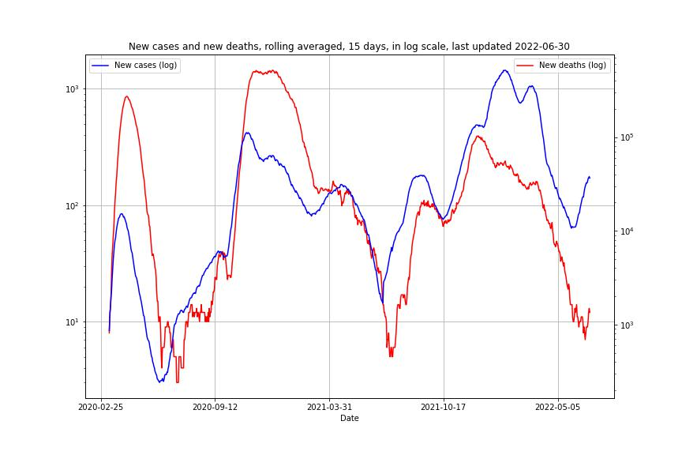
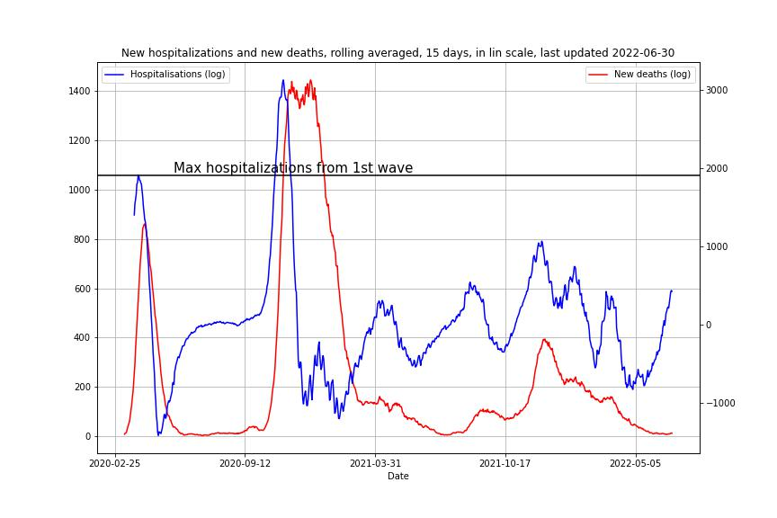

# Evolution of covid-19 in switerland

A bunch of quick plots for my own understanding data is directly pulled from Daniel Probst's github (who just aggregates Zurich Hospital's Data) and the data is updated whenever I commit.

## Deaths vs New cases
Plot of new cases and new deaths since the begining from the first wave, in log scale.

## Hospitalizations

## Last 15 days of new cases :

## New cases vs cummulative cases

